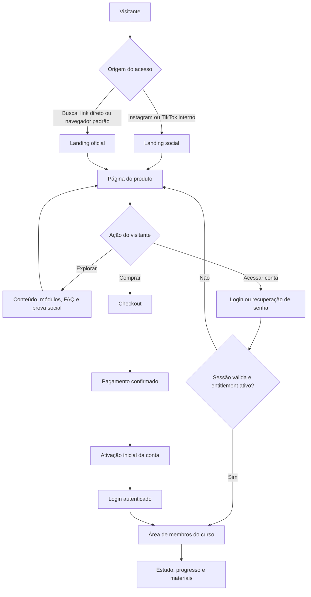
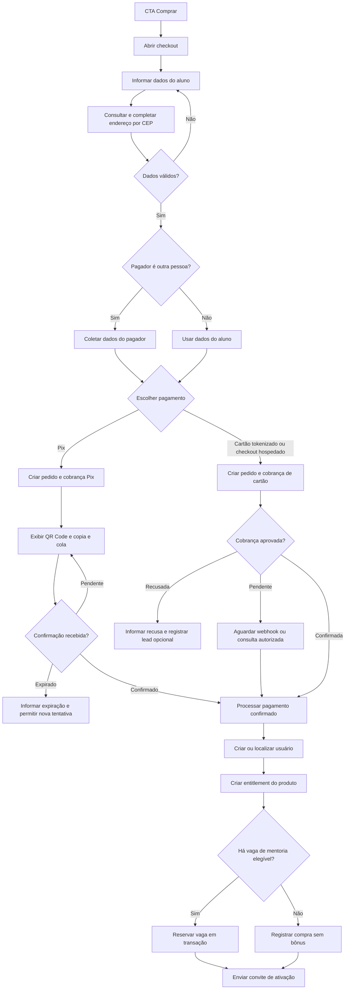
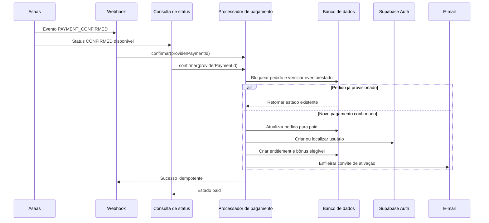
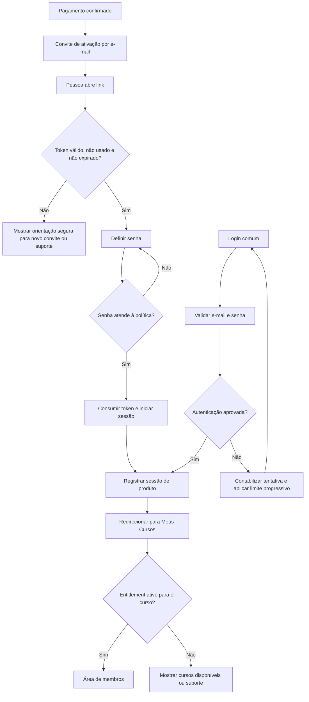
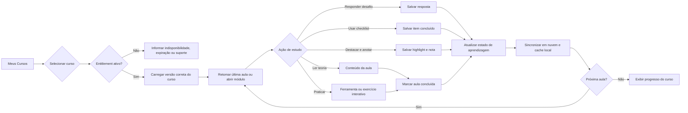
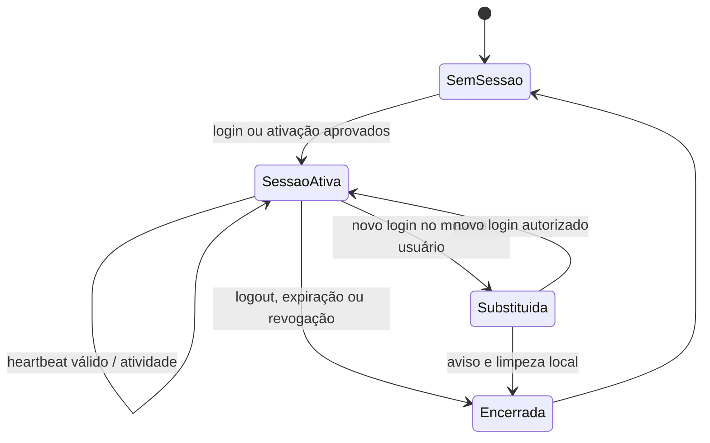
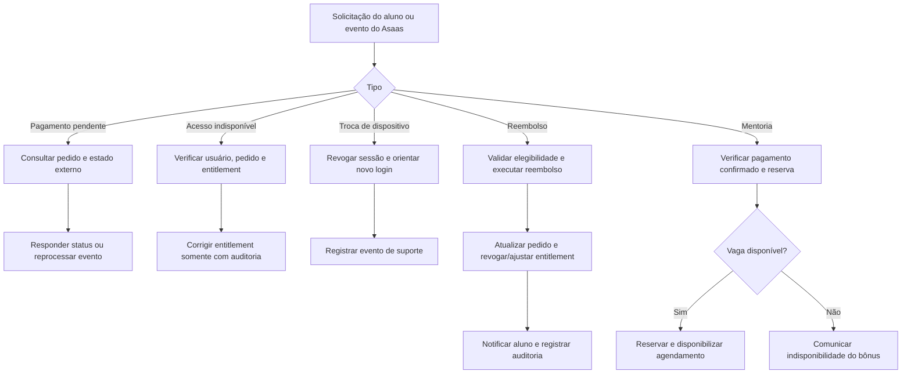

# App Flow — FLMMKR

**Produto de referência:** Color Master | Produto  
**Documentos relacionados:** [PRD](./PRD-FLMMKR.md) · [TRD](./TRD-FLMMKR.md)  
**Status:** fluxo-alvo para lançamento, derivado da análise da aplicação atual  
**Data:** 5 de outubro de 2026

## 1. Objetivo do fluxo

Este documento mostra como uma pessoa atravessa a plataforma FLMMKR: da descoberta do treinamento ao estudo na área de membros, passando por checkout, pagamento, ativação de conta e regras de sessão.

O fluxo representa o comportamento que o produto deve atingir no lançamento. Onde a base atual difere desse comportamento, a seção “Regras de transição” indica o que deve ser implementado ou corrigido antes de publicar.

## 2. Visão geral

## 3. Fluxo de aquisição e descoberta

### 3.1 Entrada

1. A pessoa chega pela raiz, por `/links`, por `/cursos` ou diretamente em `/produtos/color-master-produto`.
2. Na raiz, a aplicação detecta navegador interno de rede social e seleciona a landing social ou a landing oficial. A pessoa também pode alternar manualmente a versão com o parâmetro de visualização previsto pela interface.
3. A landing apresenta marca, proposta de valor, perfil do instrutor, currículo, materiais, FAQ, garantia, condições comerciais, preço e CTA.
4. Eventos de aquisição registram visualização e clique de CTA sem enviar dados pessoais a ferramentas de analytics.

### 3.2 Decisão

O visitante pode seguir três caminhos:

- Continuar explorando a página e voltar para a oferta.
- Abrir o login para acessar um curso comprado anteriormente.
- Abrir o checkout para iniciar uma nova compra.

### 3.3 Regra de catálogo

Cada página de venda deve resolver um único `productSlug` para um único produto ativo. Esse produto precisa apontar para uma versão específica de curso e para suas regras de preço/acesso. A rota não deve decidir, por conta própria, qual conteúdo é liberado.

## 4. Fluxo de checkout e pagamento

### 4.1 Regras do checkout

- O servidor resolve o produto vendável e calcula preço/lote. O valor exibido pelo navegador é informativo e nunca fonte de verdade.
- O checkout cria uma ordem interna antes ou junto da cobrança externa. A ordem contém produto, valor, comprador, método e identificador do provedor.
- CPF, endereço e dados de pagador são usados somente nas finalidades de cobrança e suporte definidas na política de privacidade.
- Dados de cartão não são persistidos pela aplicação e não entram em logs. A modalidade final deve ser tokenizada ou hospedada pelo Asaas, após avaliação de PCI DSS.
- Pix permanece em estado pendente até confirmação do Asaas. A interface pode consultar um endpoint autorizado, mas o webhook é a confirmação financeira confiável.
- Recusa de cartão e abandono podem gerar lead separado de aluno, sujeito às regras de privacidade e retenção.

### 4.2 Eventos concorrentes

O pagamento pode ser confirmado pelo webhook e pela consulta de status quase ao mesmo tempo. Ambos devem chamar o mesmo caso de uso idempotente:

## 5. Fluxo de ativação, login e acesso

### 5.1 Primeiro acesso

- O convite só é emitido depois de pagamento confirmado.
- O token não deve conter dados pessoais legíveis nem depender de `email` recebido pela URL para autorizar mudança de senha.
- Cada token vale uma única vez, expira em prazo curto e pode ser reenviado por fluxo controlado.
- Ao concluir a senha, a pessoa já pode iniciar sessão e acessar somente seus entitlements ativos.

### 5.2 Login recorrente

- O aluno fornece e-mail e senha.
- Falhas sucessivas sofrem limitação progressiva por conta e IP. Em nível crítico, o sistema pode enviar alerta sem revelar se o e-mail possui conta para agentes não autenticados.
- O login bem-sucedido cria ou renova a sessão de produto e desativa as demais sessões ativas se a política de sessão única estiver habilitada.
- Recuperação de senha usa o fluxo seguro do Supabase ou equivalente; não libera curso sem validar a identidade.

## 6. Fluxo de área de membros e aprendizagem

### 6.1 Abertura de curso

1. O aluno autenticado abre “Meus Cursos”.
2. O servidor retorna apenas os produtos com entitlement ativo.
3. Ao escolher um curso, o servidor resolve a versão de conteúdo autorizada.
4. A interface restaura a última aula, aba e posição de leitura quando existirem.
5. Materiais privados são disponibilizados somente após checagem de entitlement e por URLs temporárias/assinadas.

### 6.2 Estudo de uma aula

A área de membros deve oferecer, quando existir para a aula/módulo:

- Teoria e mídia da aula.
- Prática com ferramenta interativa ou exercício.
- Desafio com resposta estruturada.
- Checklist de aplicação.
- Marcação de aula concluída e avanço para a próxima.
- Destaques coloridos e notas sobre o texto.
- Busca por módulo, aula e conceito.

O estado é salvo primeiro de modo resiliente no cliente e sincronizado depois com a nuvem para usuário autenticado. Em conflitos, vence o registro com data mais recente para campos independentes; respostas/nota exigem estratégia explícita para não perder conteúdo do aluno.

### 6.3 Regra de conteúdo correto

O fluxo de compra do **Color Master | Produto** deve carregar apenas o currículo Color Master. A atual trilha de 74 aulas sobre iluminação precisa ser cadastrada como produto separado ou removida da rota de entrega antes da venda. Essa é uma transição de catálogo, não uma escolha de interface.

## 7. Fluxo de sessão única e segurança

### 7.1 Regras

- O token de sessão de produto é aleatório, armazenado no navegador e persistido somente como hash no banco.
- Um novo login de mesmo usuário inativa a sessão anterior de forma transacional.
- O heartbeat verifica se o token pertence ao usuário autenticado e se ainda está ativo. Ele não aceita `userId` arbitrário fornecido pelo cliente.
- Caso a sessão seja substituída, a interface comunica a desconexão sem revelar informações excessivas do outro dispositivo.
- Logout, expiração de entitlement ou mudança de senha encerram/reavaliam a sessão conforme a política de segurança.

## 8. Fluxo operacional: suporte, reembolso e mentoria

### 8.1 Reembolso

O reembolso segue um estado de pedido auditável. Quando confirmado pelo Asaas ou por ação administrativa autorizada, o entitlement muda para `refunded` ou `revoked` segundo a política comercial. A plataforma não deve apenas ocultar o curso no cliente.

### 8.2 Mentoria

As dez vagas promocionais são reservadas apenas quando o pedido é confirmado e enquanto houver capacidade. A reserva precisa ser transacional para impedir que eventos simultâneos atribuam a 11ª vaga. O aluno elegível recebe orientação de agendamento; o não elegível vê a condição real sem promessa ambígua.

## 9. Estados principais

### Pedido

`created` → `pending` → `paid` → `refunded`  
`created` ou `pending` → `failed` / `overdue` / `cancelled`

Transições para `paid` são efetuadas somente após confirmação confiável do Asaas. Uma ordem paga não retorna a `pending`.

### Entitlement

`active` → `expired`  
`active` → `revoked`  
`active` → `refunded`

Somente `active` e com `expires_at` futuro habilita o carregamento de curso e materiais privados.

### Produto

`draft` → `waitlist` ou `on_sale` → `archived`

Somente `on_sale` é aceito por checkout. `waitlist` capta interesse; não cria cobrança.

## 10. Tratamento de erros e saídas alternativas

- **Dados inválidos:** manter dados preenchidos, destacar o campo específico e não criar ordem/cobrança.
- **CEP indisponível:** permitir preenchimento manual do endereço e informar o problema sem bloquear o fluxo desnecessariamente.
- **Asaas indisponível:** informar indisponibilidade temporária; não repetir criação de pagamento sem idempotency key.
- **Pix expirado:** encerrar a tentativa anterior e oferecer novo checkout com preço vigente calculado no servidor.
- **Cartão recusado:** apresentar mensagem clara e não expor motivo técnico/sensível; permitir nova tentativa ou Pix.
- **Webhook repetido:** responder sucesso idempotente, sem novo acesso, e-mail ou bônus.
- **Link de ativação inválido:** direcionar para reenvio controlado ou suporte, sem permitir enumeração de e-mails.
- **Curso expirado:** manter histórico/compra visível quando apropriado e direcionar a renovação/suporte; bloquear conteúdo protegido.
- **Rede offline durante estudo:** preservar alterações locais e sincronizar quando voltar, com feedback discreto de pendência.

## 11. Telemetria do fluxo

Os seguintes eventos permitem medir gargalos sem armazenar informações pessoais em plataformas de analytics:

- `landing_viewed`, `product_cta_clicked`, `checkout_opened`, `checkout_started`.
- `checkout_validation_failed`, `payment_created`, `payment_pending`, `payment_paid`, `payment_failed`, `payment_overdue`.
- `activation_started`, `activation_completed`, `login_succeeded`, `login_failed`, `session_replaced`.
- `course_opened`, `lesson_opened`, `lesson_completed`, `material_downloaded`, `challenge_saved`.

Cada evento deve conter, no máximo, produto, versão de curso, origem de campanha, método de pagamento de alto nível e identificador pseudônimo de sessão. E-mail, CPF, endereço, token, IP, resposta de desafio, texto de nota e dados de cartão são proibidos.

## 12. Regras de transição antes do lançamento

1. Associar `color-master-produto` a uma versão de curso Color Master publicada e protegida por entitlement.
2. Criar as migrations de pedido, entitlement, progresso, segurança e mentoria previstas no TRD.
3. Trocar o primeiro acesso por convite/token seguro e proteger todos os endpoints privados por sessão server-side.
4. Tornar webhooks/consultas de pagamento idempotentes e observar pagamentos pagos sem entitlement como alerta crítico.
5. Definir a integração de cartão compatível com requisitos do Asaas e PCI DSS.
6. Implementar reembolso, expiração de 365 dias e reserva das vagas de mentoria como estados persistidos.
7. Validar os fluxos em navegador mobile e desktop, com Pix pendente/confirmado/expirado, cartão aprovado/recusado, troca de dispositivo e curso expirado.

O fluxo só está pronto para produção quando esses caminhos entregam o mesmo produto prometido na landing, cobram o valor correto, concedem acesso uma única vez e preservam os dados e a conta do aluno.
