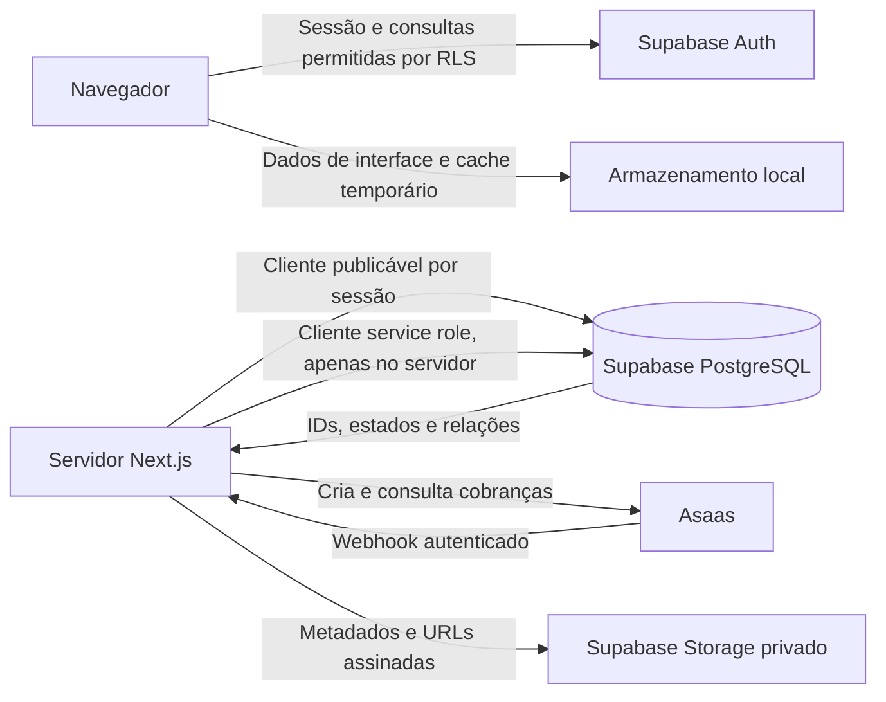
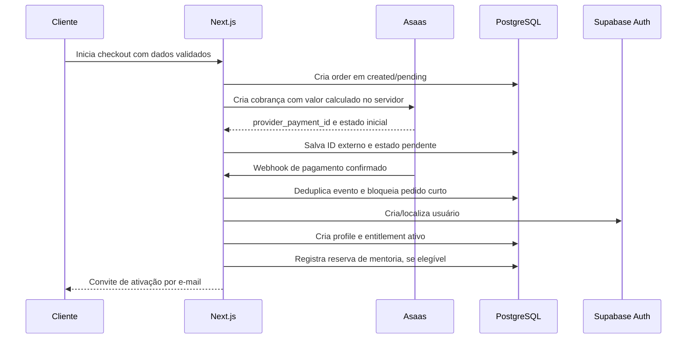
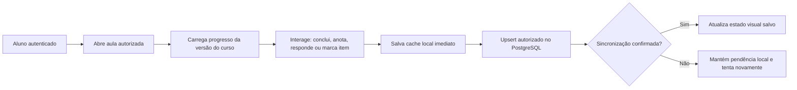

# Esquema Backend — FLMMKR

**Escopo:** criação, armazenamento, segurança e ciclo de vida dos dados  
**Base tecnológica:** Next.js, Supabase Auth, Supabase PostgreSQL, Supabase Storage e Asaas  
**Documentos relacionados:** [PRD](./PRD-FLMMKR.md) · [TRD](./TRD-FLMMKR.md) · [App Flow](./APP-FLOW-FLMMKR.md)  
**Status:** modelo-alvo para implementação por migrations  
**Data:** 5 de outubro de 2026

## 1. Finalidade

Este documento mostra onde os dados da FLMMKR nascem, onde são guardados, quem pode lê-los ou alterá-los e como cada dado se relaciona com compra, acesso e aprendizagem.

O banco deve responder a quatro perguntas sem depender de regras soltas no frontend:

1. Quem é a pessoa autenticada?
2. O que ela comprou e qual é o estado financeiro da compra?
3. A que curso ela tem acesso, por quanto tempo e em qual versão?
4. Como ela está progredindo no curso?

## 2. Princípios de armazenamento

- **Supabase Auth identifica a pessoa.** O registro em `auth.users` é a identidade canônica; senha e tokens de autenticação ficam sob gestão do Auth, nunca em tabelas da aplicação.
- **PostgreSQL guarda estado de negócio.** Perfil, catálogo, pedido, entitlement, progresso, sessões e auditoria são dados de aplicação em tabelas versionadas por migration.
- **Asaas é a fonte financeira externa.** A FLMMKR grava identificadores e estado de negócio da cobrança, mas não replica dados completos de cartão/Pix nem assume pagamento sem confirmação confiável.
- **Storage guarda arquivos, não dados relacionais.** Vídeos, footages, projetos e materiais privados ficam em bucket privado; o banco guarda metadados, versão e relação com curso/material.
- **LocalStorage é cache, não fonte de verdade.** Pode preservar rascunho e experiência offline, mas acesso, compra, expiração e progresso sincronizado pertencem ao backend.
- **O menor privilégio prevalece.** Navegador usa chave publicável e RLS. Credencial de serviço fica exclusivamente no servidor Next.js para webhooks e tarefas administrativas.
- **Dados financeiros e de autorização são imutáveis ou auditáveis.** Uma confirmação de pagamento, concessão/revogação de acesso e reembolso deixam trilha de evento.

## 3. Arquitetura de persistência



### Limites de responsabilidade

- O navegador não calcula preço definitivo, não grava pedidos diretamente e não cria entitlement.
- O servidor chama Asaas, valida webhook, executa provisionamento idempotente e emite URLs temporárias de material.
- O banco aplica constraints e RLS mesmo quando houver erro na aplicação.
- O Storage só serve materiais privados após checagem de entitlement; arquivos públicos de marketing podem permanecer em área pública/CDN.

## 4. Situação atual encontrada

### Tabelas criadas pelas migrations atuais

- `profiles`: perfil do aluno ligado a `auth.users`.
- `pending_checkouts`: dados de cobrança Pix aguardando confirmação.
- `checkout_abandonment_leads`: leads de abandono ou pagamento recusado.
- `offer_timer_sessions`: estado de cronômetro promocional por identificador de dispositivo/IP.

### Tabelas usadas pelo código, mas ausentes das migrations disponíveis

- `user_active_sessions`.
- `login_security_tracking`.
- `security_audit_logs`.
- `user_reading_state`.
- `user_highlights`.

### Inconsistências a corrigir

- A migration de `profiles` não cria todos os campos que o código usa, como papel, acesso integral e avatar.
- `pending_checkouts` não possui relação explícita com produto, pedido ou entitlement; não é suficiente para determinar o curso comprado.
- O schema Prisma, as migrations SQL e o runtime Supabase descrevem estruturas parcialmente diferentes. Apenas um fluxo deve ser canônico: migrations Supabase para alterações de banco.
- Conclusão de aulas, checklists e desafios estão hoje apenas no navegador; leitura e destaques tentam sincronizar com tabelas que ainda não estão migradas.
- A área de membros não possui um entitlement por produto/curso que aplique os 365 dias de acesso prometidos.

## 5. Modelo lógico alvo

```mermaid
erDiagram
    AUTH_USERS ||--|| PROFILES : possui
    AUTH_USERS ||--o{ ORDERS : compra
    PRODUCTS ||--o{ COURSE_VERSIONS : possui
    PRODUCTS ||--o{ ORDERS : vendido_em
    PRODUCTS ||--o{ ENTITLEMENTS : libera
    COURSE_VERSIONS ||--o{ ENTITLEMENTS : fixa_conteudo
    ORDERS ||--o| ENTITLEMENTS : concede
    AUTH_USERS ||--o{ ENTITLEMENTS : recebe
    CAMPAIGNS ||--o{ MENTORSHIP_RESERVATIONS : controla
    ORDERS ||--o| MENTORSHIP_RESERVATIONS : pode_gerar
    AUTH_USERS ||--o{ LESSON_PROGRESS : estuda
    COURSE_VERSIONS ||--o{ LESSON_PROGRESS : contextualiza
    AUTH_USERS ||--o{ CHALLENGE_RESPONSES : responde
    AUTH_USERS ||--o{ CHECKLIST_STATES : conclui
    AUTH_USERS ||--o{ USER_HIGHLIGHTS : anota
    AUTH_USERS ||--o{ USER_ACTIVE_SESSIONS : autentica
    AUTH_USERS ||--o{ SECURITY_AUDIT_LOGS : afeta
    ORDERS ||--o{ PAYMENT_EVENTS : recebe
    COURSE_VERSIONS ||--o{ COURSE_MATERIALS : inclui
    STORAGE_OBJECTS ||--o{ COURSE_MATERIALS : representa

    AUTH_USERS {
        uuid id PK
        text email
    }
    PROFILES {
        uuid id PK
        text full_name
        text phone
        text avatar_url
        text role
    }
    PRODUCTS {
        uuid id PK
        text slug UK
        text status
        int access_duration_days
    }
    COURSE_VERSIONS {
        uuid id PK
        uuid product_id FK
        text version
        text status
    }
    ORDERS {
        uuid id PK
        uuid user_id FK
        uuid product_id FK
        text provider_payment_id UK
        numeric amount
        text status
    }
    ENTITLEMENTS {
        uuid id PK
        uuid user_id FK
        uuid product_id FK
        uuid order_id FK
        uuid course_version_id FK
        text status
        timestamptz expires_at
    }
    PAYMENT_EVENTS {
        uuid id PK
        uuid order_id FK
        text provider_event_id UK
        text event_type
        timestamptz received_at
    }
    CAMPAIGNS {
        uuid id PK
        text status
        int capacity
    }
    MENTORSHIP_RESERVATIONS {
        uuid id PK
        uuid campaign_id FK
        uuid order_id FK
        text status
    }
    COURSE_MATERIALS {
        uuid id PK
        uuid course_version_id FK
        text storage_path UK
        text status
    }
    STORAGE_OBJECTS {
        text path PK
        text bucket_id
    }
    LESSON_PROGRESS {
        uuid user_id FK
        uuid course_version_id FK
        text lesson_id
        timestamptz completed_at
    }
    CHALLENGE_RESPONSES {
        uuid user_id FK
        uuid course_version_id FK
        text challenge_id
        jsonb response
    }
    CHECKLIST_STATES {
        uuid user_id FK
        uuid course_version_id FK
        text checklist_item_id
        boolean is_completed
    }
    USER_HIGHLIGHTS {
        uuid id PK
        uuid user_id FK
        text lesson_id
        text note
    }
    USER_ACTIVE_SESSIONS {
        uuid id PK
        uuid user_id FK
        text session_token_hash UK
        boolean is_active
    }
```



O diagrama é lógico. `AUTH_USERS` pertence ao schema gerenciado pelo Supabase e não deve ser alterado diretamente; as demais entidades ficam no schema da aplicação, em `public` com RLS ou em schema privado quando não precisam da Data API.

## 6. Entidades e como os dados são criados

### 6.1 `auth.users` — identidade e credencial

**Quando é criado:** somente após pagamento confirmado ou em fluxo administrativo autorizado. A criação ocorre por API administrativa do Supabase Auth no servidor.

**O que guarda:** e-mail normalizado, hash de senha, sessões de Auth, confirmação de e-mail e metadados mínimos. A senha nunca passa para `profiles`, `orders` ou logs.

**Quem acessa:** Supabase Auth; servidor com credencial administrativa; o próprio usuário por meio da sessão. Não expor lista de usuários ao cliente.

### 6.2 `profiles` — dados de apresentação e contato do aluno

**Quando é criado:** junto da criação/localização da identidade, no mesmo caso de uso de provisionamento.

**O que guarda:** `id` igual ao ID de `auth.users`, nome completo, telefone, avatar e papel de aplicação. Dados de endereço, CPF, identificador Asaas e pagamento não devem ficar misturados ao perfil que o próprio usuário atualiza.

**Quem pode alterar:** o aluno altera apenas campos permitidos de apresentação/contato; papel, situação de acesso e dados financeiros são alterados somente no servidor administrativo.

**Regra:** separar dados de perfil dos dados de cobrança reduz exposição acidental no cliente.

### 6.3 `products` — produto comercial

**Quando é criado:** por administrador, por migration inicial ou por backoffice futuro.

**O que guarda:** `slug`, nome, estado de venda, descrição resumida, duração de acesso e configurações comerciais que não sejam segredo.

**Estados:** `draft`, `waitlist`, `on_sale`, `archived`.

**Regra:** somente `on_sale` pode gerar checkout. Cada produto representa uma promessa comercial e não pode liberar curso diferente do anunciado.

### 6.4 `course_versions` — versão imutável do conteúdo

**Quando é criada:** ao publicar ou atualizar o currículo de um produto.

**O que guarda:** produto relacionado, versão, título, manifesto de módulos/aulas, data de publicação e estado (`draft`, `published`, `retired`).

**Regra:** um entitlement fixa a versão de conteúdo concedida. Assim, mudanças futuras não removem silenciosamente uma aula/material já entregue ao aluno, salvo decisão comercial explícita.

### 6.5 `course_materials` e Storage — arquivos do treinamento

**Quando é criado:** ao publicar material de uma versão de curso.

**O que guarda no banco:** curso/versão, tipo de material, título, caminho do objeto privado, tamanho, versão/hash, direitos de uso e estado de publicação.

**O que guarda no Storage:** vídeo, footage, projeto, imagem ou documento. Não guardar o binário na tabela PostgreSQL.

**Acesso:** o servidor verifica entitlement ativo e entrega URL assinada de curta duração. Material de marketing pode usar bucket público separado.

### 6.6 `orders` — registro de compra

**Quando é criado:** quando o checkout válido é iniciado e antes/depois de criar a cobrança no Asaas, utilizando uma idempotency key.

**O que guarda:** aluno/usuário quando já disponível, produto, e-mail do comprador, nome do pagador, valor em `numeric(10,2)`, moeda, método, estado de negócio, IDs do Asaas e datas relevantes.

**Estados:** `created`, `pending`, `paid`, `failed`, `overdue`, `cancelled`, `refunded`.

**Regra:** o identificador da cobrança externa é único. Dados completos de cartão, CVV e payload bruto de Pix não são armazenados.

### 6.7 `payment_events` — recebimento idempotente de eventos externos

**Quando é criado:** toda vez que o Asaas envia webhook válido ou quando uma consulta autorizada detecta mudança de estado.

**O que guarda:** pedido relacionado, ID único do evento no provedor quando disponível, tipo de evento, data de recebimento, resultado do processamento e uma carga minimizada/redigida para diagnóstico.

**Regra:** `provider_event_id` único impede que webhook repetido crie acesso, e-mail ou mentoria duplicados. O payload bruto, se for necessário por curto prazo, deve ficar em storage/auditoria protegida e com expurgo definido.

### 6.8 `entitlements` — direito de acesso ao produto

**Quando é criado:** somente após um pedido chegar a `paid`, em transação idempotente.

**O que guarda:** usuário, produto, pedido de origem, versão do curso, estado, início, expiração, data/motivo de revogação.

**Estados:** `active`, `expired`, `revoked`, `refunded`.

**Regra:** para o Color Master, `expires_at` é calculado a partir de `paid_at + 365 dias`, segundo a promessa vigente. A verificação de acesso consulta esta tabela no servidor e não um booleano enviado pelo navegador.

### 6.9 `mentorship_campaigns` e `mentorship_reservations` — bônus limitado

**Quando são criadas:** a campanha é criada pelo administrador; a reserva nasce com pagamento confirmado, se houver capacidade.

**O que guardam:** capacidade, vigência, critérios da campanha, pedido elegível, usuário, estado de reserva/agendamento e datas de realização.

**Regra:** a reserva de uma das 10 vagas acontece em transação curta e serializada; pagamento pendente não ocupa vaga.

### 6.10 `lesson_progress`, `challenge_responses`, `checklist_states` e `user_highlights` — aprendizagem

**Quando são criadas:** na primeira interação do aluno com cada item; atualizar via `upsert` usando chave natural composta.

**O que guardam:**

- `lesson_progress`: última abertura, aba, posição de leitura, percentual e data de conclusão.
- `challenge_responses`: resposta estruturada do desafio e data de atualização.
- `checklist_states`: estado concluído/pendente por item.
- `user_highlights`: aula, seção, trecho, contexto, cor, nota e data.

**Regra:** cada registro é vinculado a `user_id` e `course_version_id`. O cliente pode manter cache local para resiliência, mas o banco é a fonte de verdade para sincronizar dispositivos.

### 6.11 `user_active_sessions` e `login_security_tracking` — segurança de conta

**Quando são criadas:** sessão de produto no login/ativação; tracking no primeiro erro de login.

**O que guardam:**

- `user_active_sessions`: hash do token de sessão, dispositivo rotulado, localização aproximada opcional, atividade, substituição e expiração.
- `login_security_tracking`: identificador da conta normalizado, contagem em janela, nível de escalonamento, data de bloqueio e dados mínimos de diagnóstico.

**Regra:** o token puro nunca entra no banco. Um novo login pode invalidar sessões anteriores; o heartbeat confirma que token e usuário autenticado ainda correspondem.

### 6.12 `security_audit_logs` — trilha de eventos sensíveis

**Quando é criado:** mudança de senha, concessão/revogação de acesso, alteração administrativa, login bloqueado, reembolso, erro de webhook ou ação de suporte relevante.

**O que guarda:** tipo do evento, ator, sujeito afetado, IDs internos, request ID, data e detalhes minimizados.

**Nunca guarda:** senha, refresh token, API key, número de cartão, CVV, CPF integral, payload de checkout ou conteúdo privado completo.

### 6.13 `checkout_abandonment_leads` e `offer_timer_sessions` — dados de marketing

**Quando são criados:** abandono/recusa de checkout e início de campanha promocional, respectivamente.

**O que guardam:**

- Leads: contato mínimo, estado de abandono/recusa, método e motivo quando houver base legal.
- Timer: identificador pseudônimo da campanha, expiração e estado; não deve ser chamado de “MAC address”, porque um navegador não fornece o MAC real da máquina.

**Regra:** são dados separados de aluno e pagamento; têm retenção curta, acesso apenas server-side e não concedem acesso a curso.

## 7. Relações e constraints essenciais

### Identidade

- `profiles.id` é PK e FK para `auth.users.id` com `on delete cascade`.
- Cada usuário possui no máximo um perfil.
- `profiles.email` serve para exibição/contato, mas `auth.users.email` é a autoridade de autenticação. Atualização de e-mail ocorre pelo fluxo do Auth e replica perfil de modo controlado.

### Catálogo e conteúdo

- `products.slug` é único e em lowercase/snake/kebab case definido pela aplicação.
- `course_versions.product_id` referencia `products.id` e recebe índice.
- Cada produto tem no máximo uma versão publicada padrão. Essa garantia pode ser implementada por índice único parcial no estado publicado.

### Compras

- `orders.provider_payment_id` é único quando presente.
- `orders.amount` usa `numeric(10,2)` e `currency` usa código ISO de três letras.
- `orders.status` possui `check constraint` com os estados aceitos.
- `orders.user_id`, `orders.product_id` e `payment_events.order_id` são FKs indexadas.
- O banco impede uma transição inválida de estado por função transacional ou constraint/trigger revisada; a aplicação não altera pedido pago para pendente.

### Acessos

- `entitlements` referencia usuário, produto, pedido e versão de curso, com índices para `user_id`, `product_id` e `course_version_id`.
- Criar índice parcial para as consultas frequentes de entitlement ativo por usuário/produto, filtrado por `status = 'active'`.
- Impedir dois entitlements ativos simultâneos para o mesmo usuário/produto salvo renovação explicitamente suportada. Um índice único parcial ou função transacional deve garantir essa regra.

### Aprendizagem

- `lesson_progress` usa chave única por `user_id`, `course_version_id` e `lesson_id`.
- `challenge_responses` e `checklist_states` usam chaves naturais equivalentes para permitir `upsert` seguro.
- Índices compostos começam por `user_id` e depois `course_version_id`, que são os filtros das consultas do aluno.

### Convenções de Postgres

- Identificadores ficam em `lowercase_snake_case` sem aspas.
- Datas usam `timestamptz` em UTC; a interface converte para o fuso do usuário apenas na apresentação.
- Valores monetários usam `numeric`, nunca ponto flutuante.
- Strings usam `text`; limites precisam de `check constraint` quando fizerem parte da regra de negócio.
- UUIDs já são necessários para integrar com `auth.users`. Para tabelas novas de alto volume, preferir UUID temporal se suportado/validado no ambiente; caso contrário, manter UUID padrão de forma consistente em vez de introduzir uma extensão sem revisão.
- Toda FK recebe índice no lado que referencia; PostgreSQL não cria esse índice automaticamente.

## 8. Como o dado percorre o sistema

### 8.1 Compra confirmada



**Regra transacional:** chamadas HTTP ao Asaas e e-mail acontecem fora da transação do banco. A transação curta começa somente depois da confirmação e altera pedido, entitlement, reserva e auditoria em ordem consistente. Isso reduz lock e evita duplicação quando status e webhook chegam juntos.

### 8.2 Progresso de uma aula



O `upsert` verifica automaticamente o dono por RLS ou endpoint server-side. O aluno não envia um `user_id` confiável: o backend deriva a identidade da sessão autenticada.

### 8.3 Entrega de material privado

1. Aluno solicita material de uma versão de curso.
2. Servidor lê sessão e busca entitlement `active` não expirado.
3. Servidor confere que o material pertence à mesma `course_version_id`.
4. Servidor emite URL assinada de curta duração para o objeto no bucket privado.
5. O evento `material_downloaded` usa apenas IDs pseudônimos para telemetria.

## 9. Políticas de acesso (RLS e grants)

RLS é a barreira de linha; grants definem se um papel consegue alcançar a tabela pela Data API. Tabelas novas em projetos Supabase podem não receber exposição automática, portanto cada migration deve declarar intencionalmente grants e policies necessários. A mudança de comportamento de exposição da Data API está documentada no [changelog oficial do Supabase](https://supabase.com/changelog/45329-breaking-change-tables-not-exposed-to-data-and-graphql-api-automatically).

### Leitura pública

- `products` e versões/manifesta públicos: somente itens publicados e explicitamente públicos.
- Nenhuma tabela de usuário, compra, sessão, lead, timer, segurança ou pagamento é pública.

### Usuário autenticado

- Lê o próprio perfil em versão sem dados financeiros.
- Lê os próprios entitlements, progresso, desafios, checklist e destaques.
- Altera apenas seu próprio progresso e campos de perfil permitidos.
- Não insere pedido, entitlement, evento de pagamento, auditoria, lead ou sessão diretamente pelo cliente.

### Servidor com service role

- Processa checkout, Asaas, webhook, provisionamento, suporte, reembolso, campanhas, auditoria e geração de URL assinada.
- A chave de serviço não é exposta em variável `NEXT_PUBLIC_*`, componente cliente, log ou resposta HTTP.

### Exemplo de padrão de policy por propriedade

```sql
alter table public.lesson_progress enable row level security;

create policy "aluno le o proprio progresso"
on public.lesson_progress
for select
to authenticated
using ((select auth.uid()) = user_id);

create policy "aluno atualiza o proprio progresso"
on public.lesson_progress
for update
to authenticated
using ((select auth.uid()) = user_id)
with check ((select auth.uid()) = user_id);
```

Para `insert`, a policy precisa repetir a checagem em `with check`. Para ações que mudam vários registros financeiros ou de acesso, usar endpoint server-side/RPC cuidadosamente revisado; não resolver um erro de RLS com `security definer` público.

### Padrões de proteção adicionais

- Não usar `user_metadata` como autorização, pois é editável pelo próprio usuário. Funções e privilégios pertencem ao banco ou a `app_metadata` gerida pelo servidor.
- Views que expõem dados a usuários devem usar `security_invoker = true` quando suportado, ou permanecer em schema não exposto com privilégios restritos.
- Policies de `update` usam ambos `using` e `with check`; sem a segunda condição, alguém poderia tentar alterar o proprietário de uma linha.
- Todo campo usado por policy, FK, filtro frequente ou join recebe índice apropriado.

## 10. Dados pessoais, retenção e exclusão

### Classificação

- **Identidade/contato:** nome, e-mail, telefone e avatar.
- **Cadastro/cobrança:** CPF, endereço, data de nascimento, profissão e identificadores Asaas.
- **Comportamento/segurança:** IP, localização aproximada, tentativa de login, sessão e identificador pseudônimo de campanha.
- **Aprendizagem:** progresso, resposta de desafio, checklist, destaques e notas.
- **Financeiro:** produto, valor, método, status, identificador de cobrança e reembolso.

### Regras de guarda

- Definir em política aprovada a base legal, finalidade e prazo de retenção de cada categoria; prazo legal/contábil deve ser validado pela área responsável antes de automatizar exclusão.
- Separar endereço/CPF e identificadores financeiros de dados de perfil visíveis ao aluno.
- Checkouts pendentes, tokens de ativação, eventos técnicos brutos, leads de abandono e timer de oferta precisam de expurgo automático com prazo curto configurável.
- Notas e respostas de aprendizagem devem ser excluídas/anonimizadas ao término de conta quando não houver obrigação legítima de retenção.
- Backups seguem política própria de recuperação e expiração, com acesso restrito e registro de restauração.

### Operação de exclusão

Pedido financeiro normalmente é retido pelo prazo exigido; conteúdo de aprendizagem e perfil podem ser removidos/anonimizados conforme solicitação válida. A exclusão deve registrar um evento de auditoria sem reter desnecessariamente os dados apagados.

## 11. Migrations e criação física

### Fluxo obrigatório

1. Modelar a alteração no documento e revisar entidades, RLS, grants, índices, retenção e impacto no cliente.
2. Criar migration imperativa pelo Supabase CLI no repositório, sem editar migrations já aplicadas.
3. Aplicar primeiro em ambiente local/preview com dados sintéticos.
4. Validar constraints, FK indexes, grants, RLS e casos positivo/negativo de autorização.
5. Rodar advisors do Supabase/Postgres, typecheck, testes de integração e build.
6. Publicar em estratégia expandir → migrar/preencher → usar no código → remover legado em release posterior.

### Ordem de migrations recomendada

1. Alinhar `profiles` com uso real e remover dados financeiros do perfil editável.
2. Criar `products`, `course_versions` e `course_materials`.
3. Criar `orders`, `payment_events` e relação com `pending_checkouts` durante transição.
4. Criar `entitlements` e guardas de acesso.
5. Criar tabelas de progresso/aprendizagem e migrar cache quando aplicável.
6. Criar sessões, controle de login e auditoria.
7. Criar campanhas/reservas de mentoria, reembolso e jobs de expiração/expurgo.
8. Remover duplicações de `offer_timer_sessions` e tabelas legadas somente após migração validada.

### Requisitos de migration

- Usar `create table if not exists` e blocos condicionais para constraints quando houver necessidade de idempotência; PostgreSQL não aceita `add constraint if not exists`.
- Índices de FK são explícitos. Índices compostos seguem a ordem dos filtros: igualdade primeiro, faixa/data por último.
- Índices parciais atendem consultas frequentes de subconjuntos, como pedidos pendentes e entitlements ativos.
- Funções/trigger que exijam privilégios elevados ficam em schema privado, têm `search_path` fixado, checagem explícita de autor e `execute` revogado de papéis públicos por padrão.
- Migration não chama Asaas, envia e-mail ou faz operações externas; ela só altera schema/dados locais de maneira reversível e observável.

## 12. Integridade, recuperação e observabilidade

### Integridade operacional

- Processar webhooks com `provider_event_id` único e estado de processamento para reexecução segura.
- Usar idempotency key na criação de ordem/cobrança; uma repetição do clique não cria cobranças duplicadas.
- Manter transações curtas: APIs externas e e-mail ficam fora do lock de pedido/entitlement.
- Quando múltiplas linhas forem atualizadas, adquirir locks em ordem estável para reduzir deadlocks.
- Usar timeout de statement para consultas administrativas/rotinas que possam ficar presas.

### Backup e recuperação

- Programar backup do banco e testar restauração em ambiente isolado em cadência definida pela operação.
- Manter migrations no repositório como histórico reproduzível de schema.
- Registrar versão de conteúdo/material e não sobrescrever arquivo entregue sem manter versão anterior ou plano de migração.
- Ter runbook para webhook não processado, pedido pago sem entitlement, convite de ativação não enviado e acesso concedido indevidamente.

### Monitoramento

- Alertar pedido pago sem entitlement ativo dentro do SLA definido.
- Alertar erro repetido de webhook, taxa anormal de recusa e falhas de policy/RLS.
- Acompanhar latência de checkout, tempo até ativação e erros de sincronização de aprendizagem.
- Logs usam request ID e IDs internos; segredos e dados de cartão são redigidos antes de persistir.

## 13. Checklist de aceite do esquema

- Cada produto vendido aponta para curso/versão determinada e entitlement correspondente.
- O banco contém migration para todas as tabelas chamadas pelo runtime.
- Um mesmo webhook/pagamento repetido não cria duas ordens, entitlements, reservas ou notificações.
- Pagamento confirmado cria entitlement ativo com expiração persistida de 365 dias para o Color Master.
- Usuário A não consegue ler nem escrever perfil, curso, progresso, destaque, pedido ou sessão de Usuário B.
- Usuário autenticado não consegue criar/alterar pedido, entitlement, auditoria ou estado financeiro diretamente pela Data API.
- Todas as FK têm índices; consultas de entitlement ativo e progresso usam índices compostos/parciais compatíveis.
- RLS, grants e policies foram testados com usuário dono, usuário não dono, anônimo e servidor.
- Cartão, senha, token e chaves nunca são guardados em tabelas ou logs de aplicação.
- Há processo documentado para expiração, reembolso, exclusão, backup e reprocessamento de webhook.

## 14. Arquivos de referência

- `supabase/migrations/20261004_initial_auth_and_leads.sql`.
- `supabase/migrations/20261004_create_offer_timer_sessions.sql`.
- `prisma/schema.prisma`.
- `src/services/userService.ts`, `src/services/asaas.ts` e `src/services/notificationService.ts`.
- `src/app/api/checkout/**`, `src/app/api/auth/**`, `src/app/api/user/**` e `src/app/api/webhooks/asaas/route.ts`.
- `src/lib/readingStateService.ts`, `src/lib/highlightsService.ts` e `src/components/MemberAreaApp.tsx`.

Este esquema é a especificação de dados para o backend. A implementação deverá criar migrations incrementais e testar RLS/grants antes de conectar as telas de checkout e área de membros ao novo modelo.
