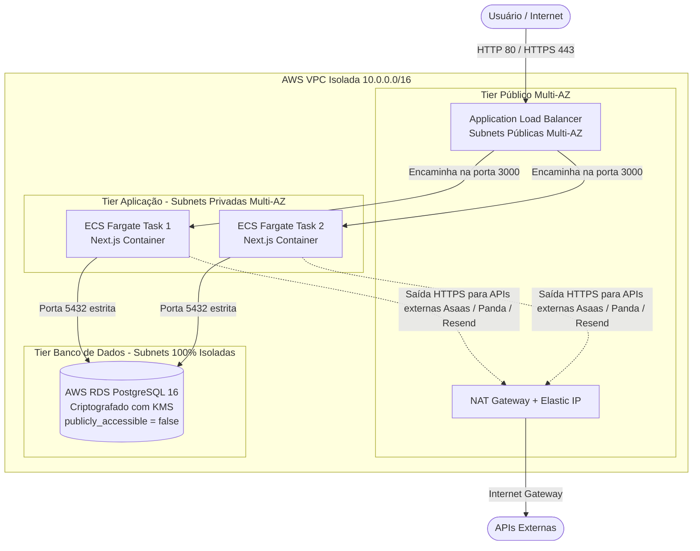

# Infraestrutura Segura AWS: ALB + ECS Fargate + RDS PostgreSQL (Terraform)

Este módulo Terraform implementa uma arquitetura em 3 camadas (*Three-Tier Architecture*) com **Isolamento Zero-Trust**, garantindo que o banco de dados e os contêineres nunca sejam expostos diretamente à internet.

---

## 🏗️ Diagrama da Arquitetura



---

## 🔒 Matriz de Autorização e Acesso (Zero-Trust)

| Componente | Onde Fica? | Quem Pode Acessar? | Porta / Protocolo | Política de Segurança |
| :--- | :--- | :--- | :--- | :--- |
| **ALB (Load Balancer)** | Subnets Públicas | Internet Pública (`0.0.0.0/0`) | `80` (HTTP) e `443` (HTTPS) | Drop invalid headers ativo; redireciona tráfego para os contêineres. |
| **ECS Fargate Tasks** | Subnets Privadas | **Apenas o ALB** | `3000` (TCP) | Sem IP público (`assign_public_ip = false`); inacessível diretamente pela internet. |
| **RDS PostgreSQL** | Subnets Privadas Isoladas | **Apenas as Tasks ECS** | `5432` (TCP) | **`publicly_accessible = false`**; sem rota para a internet nem para o NAT Gateway. |
| **Credenciais do BD** | AWS Secrets Manager | **Apenas a Role do ECS** via IAM | KMS Decrypt | Gerada com 32 caracteres aleatórios; nunca gravada em texto plano. |

---

## 🚀 Como Provisionar

### 1. Pré-requisitos
* AWS CLI configurado com credenciais com permissão para criar VPC, ECS, RDS e IAM (`aws configure`).
* Terraform `>= 1.5.0` instalado.

### 2. Inicialização e Planejamento
```bash
cd infra/terraform
terraform init
terraform plan -out=tfplan
```

### 3. Aplicação da Infraestrutura
```bash
terraform apply tfplan
```

### 4. Obtenção das Saídas
Após o término do apply:
* O DNS público do Load Balancer estará disponível em `alb_dns_name`.
* O endpoint interno do RDS estará disponível em `rds_endpoint` (apenas acessível de dentro da VPC).
* As credenciais do banco estarão seguras no AWS Secrets Manager (`database_secrets_arn`).
